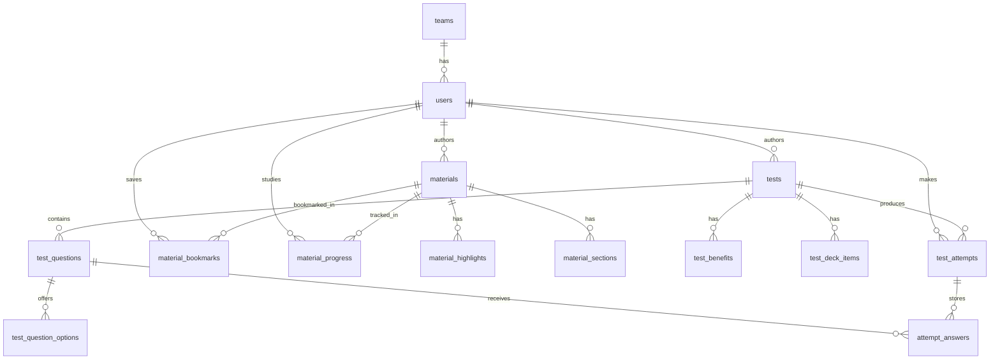

# PostgreSQL Data Model

## Общая идея

PostgreSQL должен быть единым источником истины для:

- пользователей
- регистрации
- команд
- тестов
- вопросов и ответов
- материалов
- прогресса обучения
- закладок
- результатов тестов
- лидербордов

## Сущности

### `teams`

Назначение:
- объединение пользователей в команды

Поля:
- `id uuid pk`
- `name text unique`
- `city text`
- `created_at timestamptz`

Связи:
- `teams 1 -> many users`

### `users`

Назначение:
- учётные записи пользователей

Поля:
- `id uuid pk`
- `email text unique`
- `password_hash text`
- `display_name text`
- `city text`
- `primary_track text`
- `role app_role`
- `team_id uuid fk -> teams.id`
- `created_at timestamptz`
- `updated_at timestamptz`

Связи:
- `users many -> 1 teams`
- `users 1 -> many materials (author_id)`
- `users 1 -> many tests (author_id)`
- `users 1 -> many test_attempts`
- `users many <-> many materials` через `material_bookmarks`
- `users many <-> many materials` через `material_progress`

### `materials`

Назначение:
- статьи, уроки, playbook, чек-листы

Поля:
- `id uuid pk`
- `slug text unique`
- `title text`
- `category text`
- `level difficulty_level`
- `read_time_minutes integer`
- `summary text`
- `status content_status`
- `author_id uuid fk -> users.id`
- `created_at timestamptz`
- `updated_at timestamptz`

Связи:
- `materials 1 -> many material_highlights`
- `materials 1 -> many material_sections`
- `materials many <-> many users` через `material_bookmarks`
- `materials many <-> many users` через `material_progress`

### `material_highlights`

Назначение:
- короткие акценты материала

Поля:
- `id uuid pk`
- `material_id uuid fk -> materials.id`
- `sort_order integer`
- `value text`

### `material_sections`

Назначение:
- тело материала по секциям

Поля:
- `id uuid pk`
- `material_id uuid fk -> materials.id`
- `sort_order integer`
- `title text nullable`
- `body_markdown text`

### `material_bookmarks`

Назначение:
- закладки пользователя

Поля:
- `user_id uuid fk -> users.id`
- `material_id uuid fk -> materials.id`
- `created_at timestamptz`

### `material_progress`

Назначение:
- прогресс изучения материала

Поля:
- `user_id uuid fk -> users.id`
- `material_id uuid fk -> materials.id`
- `status progress_status`
- `completed_at timestamptz nullable`
- `last_read_at timestamptz nullable`

### `tests`

Назначение:
- карточка теста или тренажёра

Поля:
- `id uuid pk`
- `slug text unique`
- `title text`
- `headline text`
- `tag text`
- `category text`
- `description text`
- `difficulty difficulty_level`
- `duration_minutes integer`
- `metric_label text`
- `accent_color varchar(7)`
- `mode test_mode`
- `status content_status`
- `config_json jsonb`
- `author_id uuid fk -> users.id`
- `created_at timestamptz`
- `updated_at timestamptz`

Связи:
- `tests 1 -> many test_benefits`
- `tests 1 -> many test_deck_items`
- `tests 1 -> many test_questions`
- `tests 1 -> many test_attempts`

### `test_benefits`

Поля:
- `id uuid pk`
- `test_id uuid fk -> tests.id`
- `sort_order integer`
- `value text`

### `test_deck_items`

Поля:
- `id uuid pk`
- `test_id uuid fk -> tests.id`
- `sort_order integer`
- `value text`

### `test_questions`

Поля:
- `id uuid pk`
- `test_id uuid fk -> tests.id`
- `prompt text`
- `explanation text nullable`
- `sort_order integer`

### `test_question_options`

Поля:
- `id uuid pk`
- `question_id uuid fk -> test_questions.id`
- `label text`
- `is_correct boolean`
- `sort_order integer`

### `test_attempts`

Назначение:
- факт прохождения теста пользователем

Поля:
- `id uuid pk`
- `test_id uuid fk -> tests.id`
- `user_id uuid fk -> users.id`
- `score integer`
- `label text`
- `summary text`
- `tier_name text`
- `started_at timestamptz`
- `completed_at timestamptz`
- `meta_json jsonb`

### `attempt_answers`

Поля:
- `id uuid pk`
- `attempt_id uuid fk -> test_attempts.id`
- `question_id uuid fk -> test_questions.id`
- `selected_option_id uuid fk -> test_question_options.id nullable`
- `is_correct boolean`

## Лидерборд

Текущий лидерборд строится через SQL view:

- `leaderboard_current`

Источники:
- `users`
- `teams`
- `test_attempts`

Логика:
- берётся лучший score пользователя
- подмешиваются команда, город и трек
- tier вычисляется на стороне БД

## Главные связи

## Что должно уйти из localStorage после полной миграции

- список тестов
- список материалов
- профиль пользователя
- закладки
- прогресс чтения
- результаты тестов
- лидерборды

После миграции в localStorage должны остаться только временные клиентские состояния.
