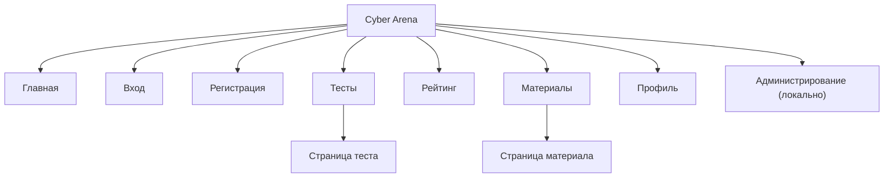
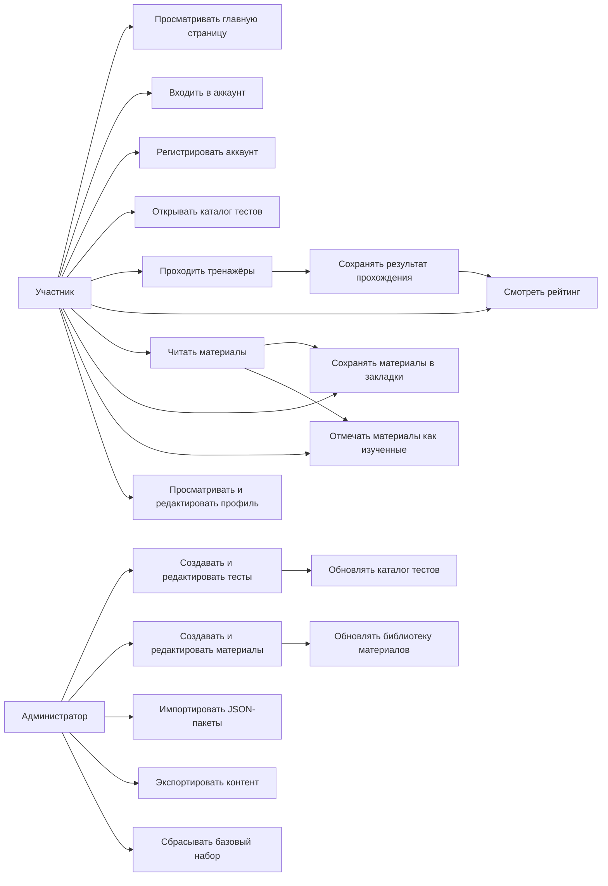

# Документация по сайту Cyber Arena

## 1. Назначение сайта

Cyber Arena это русскоязычная платформа для обучения кибербезопасности, в которой объединены:

- интерактивные тренажёры
- база знаний и учебные материалы
- рейтинг участников и команд
- личный профиль с прогрессом
- административная панель для управления контентом

Сайт рассчитан на использование в корпоративном обучении, внутренней аттестации, командных соревнованиях и регулярной практике специалистов по кибербезопасности.

## 2. Целевая аудитория

- специалисты SOC
- blue team и incident response команды
- AppSec и infrastructure security инженеры
- сотрудники, проходящие awareness-обучение
- руководители направлений, отслеживающие прогресс команды
- контент-менеджеры и администраторы платформы

## 3. Основные разделы сайта

### Главная страница

Главная страница показывает ключевую ценность продукта:

- быстрый вход в тренажёры и материалы
- витрину лучших результатов
- уровни мастерства
- подборку рекомендованных сценариев
- обзор библиотеки материалов

Маршрут:

- `/#/`

### Каталог тестов

Раздел с интерактивными тренажёрами и сценариями практики.

Пользователь может:

- просматривать все тесты
- искать по названию и описанию
- фильтровать по категориям
- переходить на страницу конкретного сценария

Маршрут:

- `/#/tests`

### Страница теста

Подробная страница тренажёра содержит:

- описание сценария
- формат и длительность
- игровую механику
- историю последних попыток
- лучший результат пользователя

Маршрут:

- `/#/tests/:slug`

### Рейтинг

Раздел с рейтингом участников и команд.

Пользователь может:

- видеть лидеров потока
- фильтровать рейтинг по трекам
- сравнивать свой результат с другими участниками

Маршрут:

- `/#/leaderboard`

### Материалы

Каталог материалов для обучения и подготовки.

Пользователь может:

- искать материалы по названию и ключевым словам
- фильтровать по категориям
- добавлять материалы в закладки
- переходить к подробной статье

Маршрут:

- `/#/materials`

### Страница материала

Подробная страница материала содержит:

- краткое описание
- основные акценты темы
- полный текст материала
- действия по сохранению в закладки
- отметку о прохождении

Маршрут:

- `/#/materials/:slug`

### Профиль

Личный кабинет пользователя.

Пользователь может:

- редактировать имя и роль
- просматривать историю попыток
- видеть список завершённых материалов
- получать рекомендации по следующим тестам
- открывать сохранённые материалы

Маршрут:

- `/#/profile`

### Регистрация

Страница создания пользовательского аккаунта.

Пользователь может:

- зарегистрировать личный аккаунт
- указать имя, email, пароль, город и направление
- создать персональный профиль для сохранения прогресса

Маршрут:

- `/#/register`

### Вход

Страница авторизации пользователя.

Пользователь может:

- войти по email и паролю
- открыть свой профиль и персональный прогресс
- продолжить обучение с сохранённой историей

Маршрут:

- `/#/login`

### Административная панель

Раздел предназначен для управления контентом платформы.

Администратор может:

- создавать и редактировать тесты
- создавать и редактировать материалы
- импортировать JSON-пакеты
- экспортировать текущий контент
- сбрасывать контент к базовому набору

Важно:

- маршрут `/admin` доступен только локально
- из публичной навигации раздел скрыт

Маршрут:

- `/#/admin`

## 4. Карта сайта

### Текстовая карта сайта

```text
Cyber Arena
├── Главная /#/
├── Вход /#/login
├── Регистрация /#/register
├── Тесты /#/tests
│   └── Тест /#/tests/:slug
├── Рейтинг /#/leaderboard
├── Материалы /#/materials
│   └── Материал /#/materials/:slug
├── Профиль /#/profile
└── Администрирование /#/admin
```

### Визуальная карта сайта



## 5. Роли пользователей

### Гость или участник

Основная публичная роль сайта.

Может:

- просматривать главную страницу
- входить в аккаунт
- создавать аккаунт
- запускать тесты
- читать материалы
- смотреть рейтинг
- вести личный профиль
- сохранять закладки
- отмечать материалы как изученные

### Администратор

Локальная административная роль.

Может:

- управлять контентом тестов
- управлять материалами
- импортировать и экспортировать контент
- поддерживать актуальность каталога

## 6. Варианты использования

### Основные пользовательские сценарии

1. Пользователь заходит на главную страницу и выбирает направление обучения.
2. Пользователь создаёт аккаунт или входит в существующий.
3. Пользователь переходит в каталог тестов и запускает нужный тренажёр.
4. После прохождения система сохраняет результат и обновляет профиль.
5. Пользователь открывает рейтинг и сравнивает свой результат с другими участниками.
6. Пользователь изучает материалы, сохраняет их в закладки и отмечает как завершённые.
7. Пользователь возвращается в профиль и получает рекомендации по следующим шагам.

### Административные сценарии

1. Администратор открывает панель управления.
2. Администратор создаёт новый тест или материал.
3. Администратор импортирует пакет контента в формате JSON.
4. Содержимое сайта обновляется и становится доступным в пользовательских разделах.

## 7. Диаграмма вариантов использования



## 8. Пользовательские потоки

### Поток обучения через тесты

1. Главная страница
2. Регистрация
3. Каталог тестов
4. Страница теста
5. Прохождение сценария
6. Сохранение результата
7. Рейтинг и профиль

### Поток обучения через материалы

1. Главная страница
2. Каталог материалов
3. Страница материала
4. Сохранение в закладки или завершение
5. Возврат в профиль

### Поток управления контентом

1. Админ-панель
2. Выбор раздела: тесты или материалы
3. Создание или редактирование записи
4. Сохранение изменений
5. Проверка результата на публичных страницах

## 9. Ключевые сущности, видимые пользователю

### Тест

Содержит:

- название
- краткое описание
- категорию
- сложность
- длительность
- механику прохождения
- набор преимуществ или тем
- историю результатов пользователя

### Материал

Содержит:

- название
- категорию
- уровень сложности
- время чтения
- краткое резюме
- ключевые акценты
- полный текст

### Пользовательский профиль

Содержит:

- email аккаунта
- имя пользователя или команды
- роль или направление
- историю попыток
- список завершённых материалов
- закладки
- рекомендации

### Рейтинг

Содержит:

- имя участника
- команду
- город
- трек
- уровень
- количество баллов

## 10. Навигационные принципы

- главные разделы доступны из верхнего меню
- ключевые действия доступны с главной страницы
- карточки тестов и материалов ведут на отдельные детальные страницы
- рейтинг и профиль служат точками возврата после прохождения тренажёров
- административный раздел изолирован от публичного сценария

## 11. Назначение документа

Этот документ можно использовать как:

- продуктовую документацию по структуре сайта
- базу для обсуждения с заказчиком
- основу для проектирования новых разделов
- справочный материал для разработчиков, дизайнеров и контент-менеджеров
